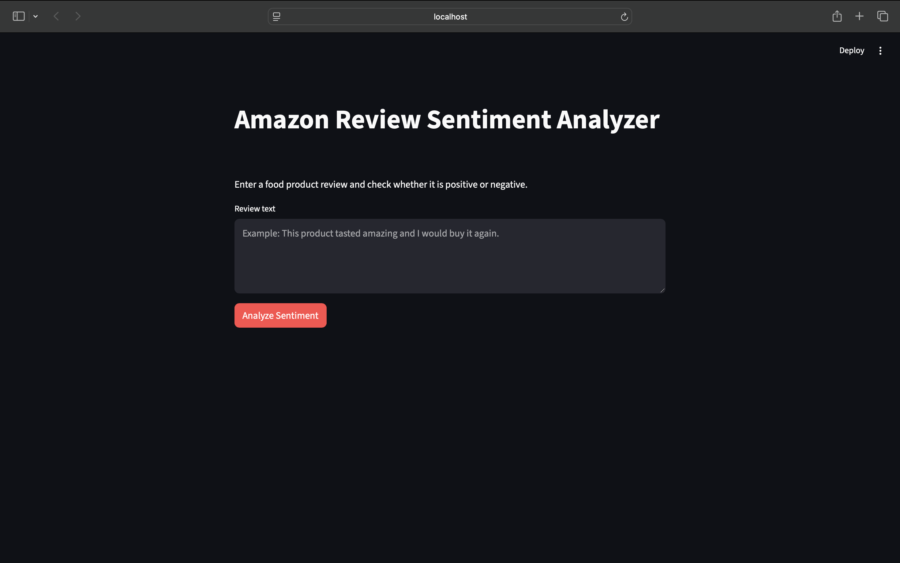
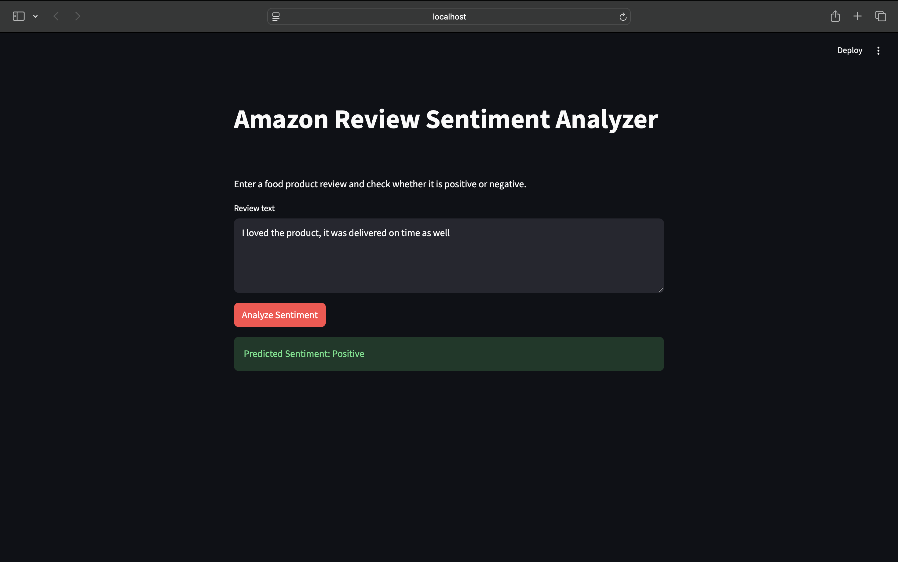
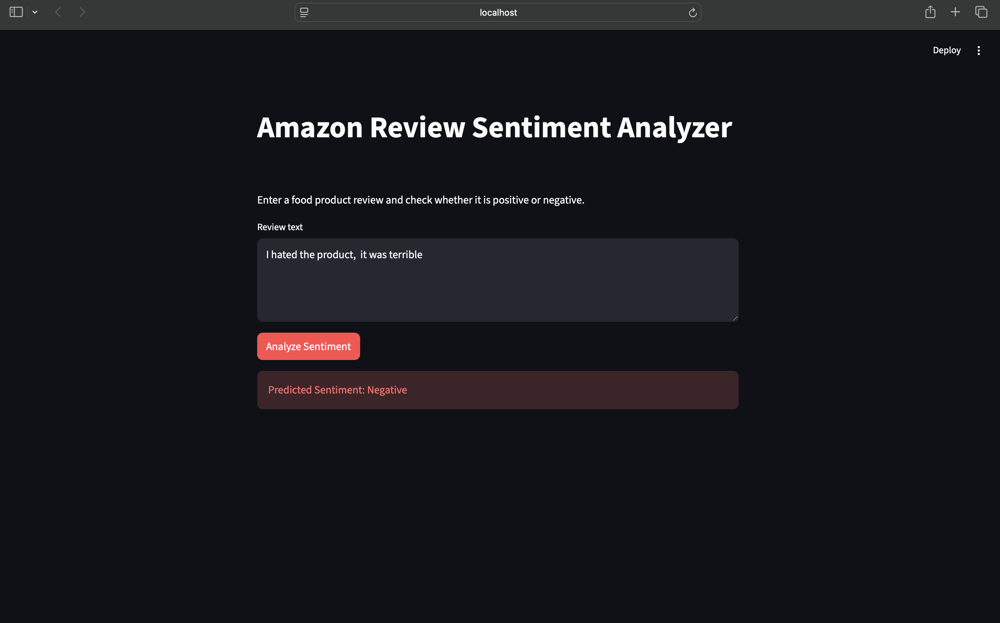
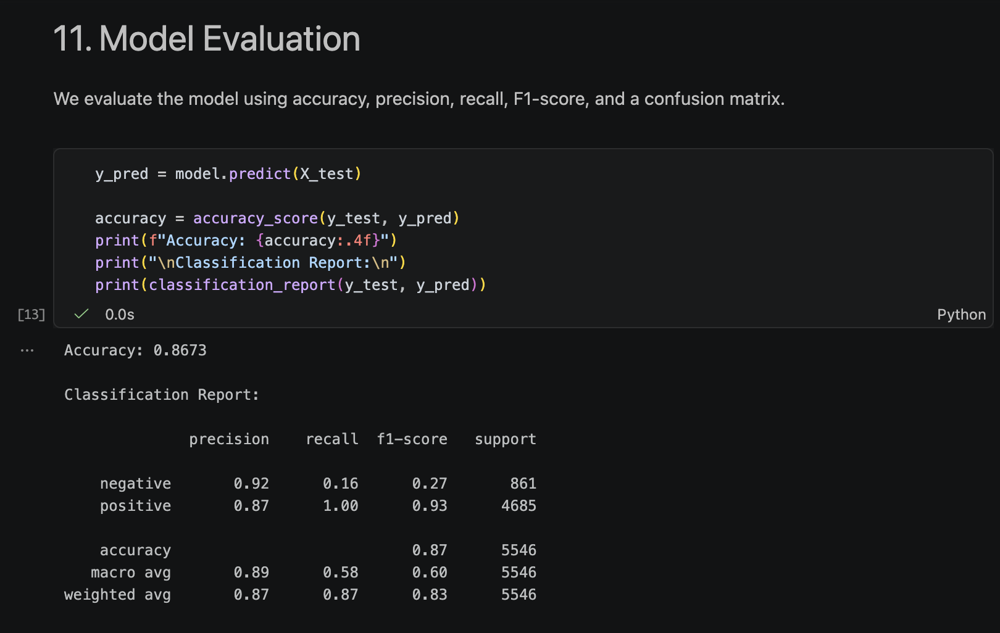
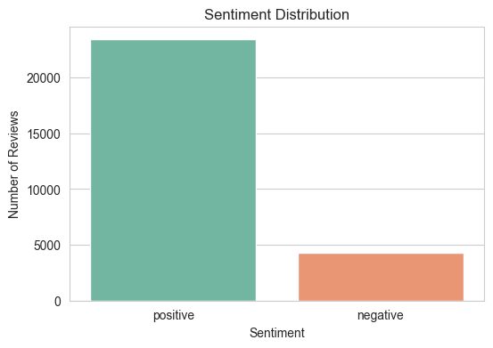
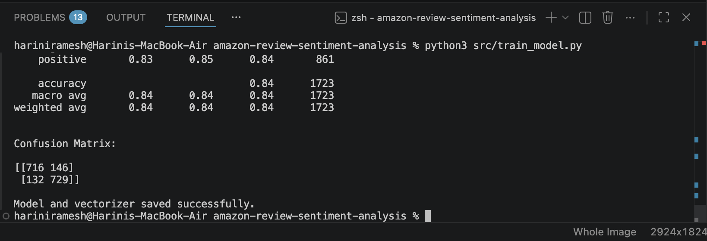
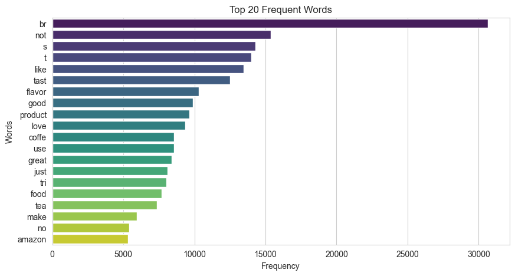

# Amazon Fine Food Review Sentiment Analyzer

An NLP-based sentiment analysis project that classifies Amazon food reviews as **positive** or **negative** using TF-IDF and Multinomial Naive Bayes.



## Overview

Customer reviews often contain useful information about product quality, taste, packaging, and overall experience. This project analyzes review text from the Amazon Fine Food Reviews dataset and predicts the sentiment behind each review.

The final model is connected to a simple Streamlit web app where users can type a review and get an instant prediction.

## Features

- Cleans and preprocesses raw review text
- Removes stopwords and applies stemming
- Converts text into TF-IDF features
- Trains a Multinomial Naive Bayes classifier
- Evaluates the model using accuracy, classification report, and confusion matrix
- Saves the trained model and vectorizer using pickle
- Provides a simple Streamlit interface for predictions

## Dataset

The project uses the **Amazon Fine Food Reviews** dataset.

Main columns used:

| Column | Description |
| --- | --- |
| `Text` | Full review written by the customer |
| `Score` | Rating from 1 to 5 |

Sentiment labels are created from the rating:

| Rating | Sentiment |
| --- | --- |
| 4 or 5 | Positive |
| 1 or 2 | Negative |
| 3 | Removed as neutral |

The dataset file is not included in this repository because it is large. Place it here before training:

```text
data/Reviews.csv
```

## Workflow

```text
Review Text
    |
Text Cleaning
    |
Stopword Removal + Stemming
    |
TF-IDF Vectorization
    |
Multinomial Naive Bayes
    |
Sentiment Prediction
```

## Model Performance

After balancing positive and negative reviews, the model achieved:

```text
Accuracy: 83.86%
```

## Screenshots

### Positive Prediction



### Negative Prediction



### Model Accuracy



### Sentiment Distribution



### Confusion Matrix



### Top Frequent Words



## Project Structure

```text
amazon-review-sentiment-analysis/
|
|-- data/
|-- notebook/
|   |-- sentiment_analysis.ipynb
|-- screenshots/
|-- src/
|   |-- preprocess.py
|   |-- train_model.py
|   |-- predict.py
|-- app.py
|-- requirements.txt
|-- README.md
```

## Tech Stack

- Python
- Pandas
- NLTK
- Scikit-learn
- Matplotlib
- Seaborn
- Streamlit

## Installation

Clone the repository and install the required libraries:

```bash
python3 -m pip install -r requirements.txt
```

## Usage

Train the model:

```bash
python3 src/train_model.py
```

Run the Streamlit app:

```bash
python3 -m streamlit run app.py
```

Then open the local URL shown in the terminal.

## Example Predictions

```text
Review: This product is amazing and I loved it.
Prediction: positive

Review: This product was terrible and I hated it.
Prediction: negative
```

## Future Improvements

- Add neutral sentiment classification
- Compare Naive Bayes with Logistic Regression
- Add n-gram features for better context
- Deploy the Streamlit app online
